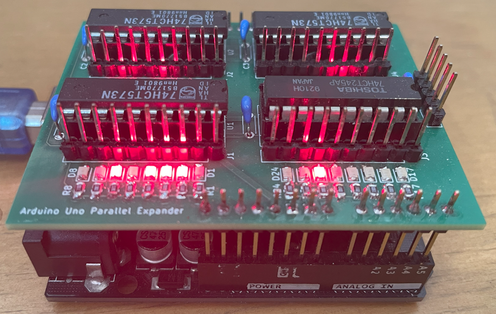
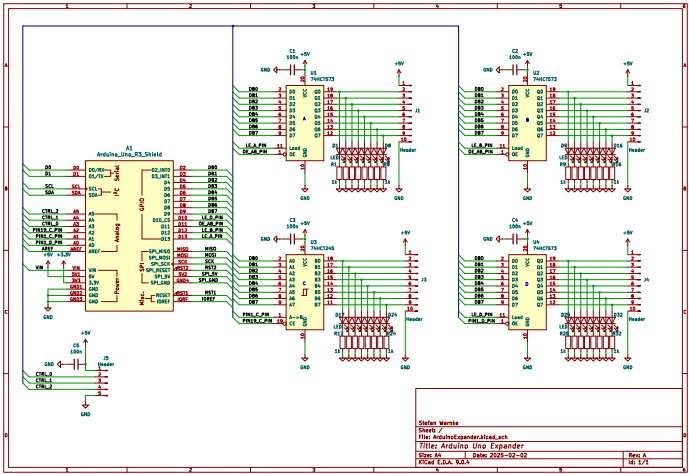
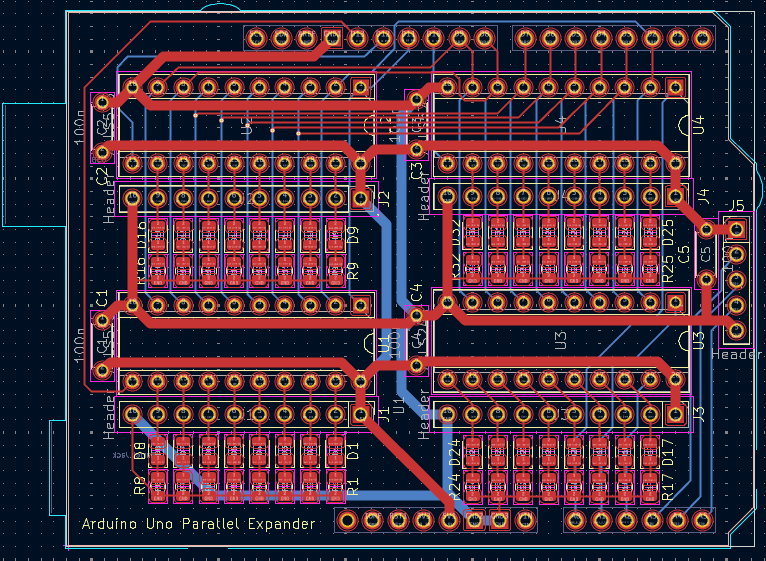
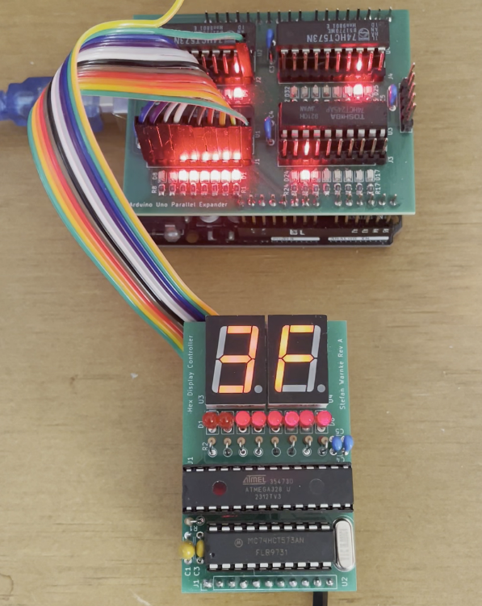

<h1 style="text-align: center;">ArduinoExpander</h1>
<h2 style="text-align: center;">IO Expander for Arduino Uno</h2>
 

  

 
This IO expander plugs into an Arduino Uno to add more controllable pins. It can be used for instance to interact with TTL circuits. One configuration can be 24 bits output and 8 bit bi-directional. Replacing the 74HCT245 chip with a 74HCT573 will give 32 bits output only.
  

  

 
The schematic and layout are design with KiCad 9.
  

  

 

The repository contains an example code to test a RAM chip on a breadboard connected to the expander as address bus, databus and control signals.

  

  

 
Here is an example to test the HexDisplayController.